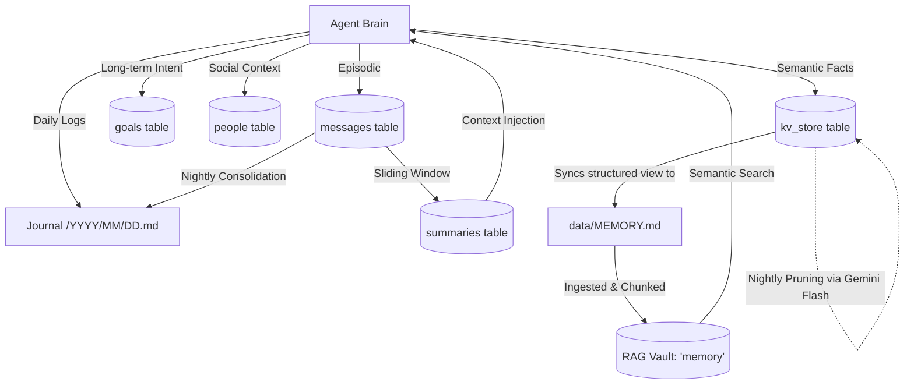

# Agent Persistence & Memory System

## Overview
DeeDee uses a multi-tiered memory architecture to maintain state, context, and long-term knowledge across restarts and interactions. The core of this system relies on a local SQLite database, augmented by Markdown files for journaling and an integrated RAG (Retrieval-Augmented Generation) vault for semantic search.

## Database Location
- **Agent Built-in Memory**: `/app/data/agent.db` (or local `data/agent.db`).
- **WhatsApp Dedicated Memory**: `/app/data/messages_user.db` and `/app/data/messages_assistant.db` (Baileys/SQLite split architecture).
- **Volume**: `agent-data` (Docker volume, preserved across container rebuilds).

## Core Architecture Diagram



## Memory Types

### 1. Episodic Memory (Conversation History)
- **Tables**: `chat_sessions` and `messages`
- **Content**: Tracks all incoming user messages and outgoing assistant replies grouped by session. 
- **Context Management**: To prevent exploding context windows, an active `summaries` table tracks conversation summaries generated via a sliding window pattern (`smart-context.js`). This acts as long-term injection into the active prompt without passing the full raw chat history.

### 2. Semantic Memory (Facts & Preferences)
- **Table**: `kv_store`
- **Content**: Key-Value pairs for explicit long-term storage (e.g., `user_name`, `api_key_x`, user preferences).
- **Agent Access**:
    - `rememberFact(key, value)`: Save information.
    - `getFact(key)`: Retrieve information.
- **RAG Integration**: Facts and key-values are periodically synced to a physical file (`data/MEMORY.md`) which is subsequently ingested into the **RAG Vault (named 'memory')**. This allows the agent to semantically search its own facts implicitly during generation.
- **Automated Memory Pruning**: A scheduled job (`nightly_memory_pruning`) runs daily, utilizing Gemini Flash to review the entire `kv_store`. It evaluates relevance, culls stale/obsolete facts, and backs them up to `data/pruned_memories.json` before removing them from active memory.

### 3. Intentional Memory (Goals)
- **Table**: `goals`
- **Content**: High-level tasks or intentions that span across sessions or restarts.
- **Usage**: Solves the "Amnesia Problem".
    1.  Before starting a complex task (like an update), the Agent adds a pending goal.
    2.  On system boot, the Agent checks for `pending` goals.
    3.  If found, the agent knows *why* it is running and seamlessly resumes its thought process.

### 4. Journal (Second Brain)
- **Files**: `/app/data/journal/YYYY/MM/DD.md`
- **Content**: Daily logs, summaries, and unstructured notes.
- **Agent Access**:
    - `logJournal(text)`: Append to today's entry.
    - `readJournal(date)`: Read a specific day.
    - `searchJournal(query)`: Text search across all entries.
- **Automation**: `nightly_consolidation` job summarizes chat logs into the journal at midnight.
- **Manual Trigger**:
    - `/consolidate`: Consolidate "Yesterday" (Local Time) immediately.

### 5. Social Memory (People)
- **Table**: `people`
- **Content**: Entity management containing contact details, relationship mapping, and interaction notes.
- **Agent Access**:
    - `listPeople()`, `getPerson(id)`, `searchPeople(query)`: Retrieval.
    - `updatePerson(id, updates)`: Modification.
- **Special Integrations**: Contains metadata for `Autopilot` status (whether DeeDee should draft responses on your behalf) and identifier mappings (WhatsApp JIDs, Telegram IDs). "Smart Learn" periodically analyzes WhatsApp history to deduce and suggest new contacts.

## Self-Improvement Workflow
1. **Plan**: Agent decides to add a feature or improve logic.
2. **Persist**: Agent calls `db.updateGoal` or creates a new one to persist intent.
3. **Execute**: Agent instructs Supervisor to update the codebase.
4. **Restart**: Supervisor pushes code -> Balena updates -> Container restarts.
5. **Resume**: Actioning Intentional Memory, the Agent boots up, reads the `goals` table, acknowledges the pending task, and alerts the user ("I am back. Verifying feature X...").

## Schema Reference (Core Tables)
```sql
CREATE TABLE messages (
  id TEXT PRIMARY KEY,
  role TEXT,
  content TEXT,
  source TEXT,
  chat_id TEXT,
  timestamp DATETIME,
  metadata TEXT
);

CREATE TABLE kv_store (
  key TEXT PRIMARY KEY,
  value TEXT
);

CREATE TABLE summaries (
  id INTEGER PRIMARY KEY AUTOINCREMENT,
  chat_id TEXT NOT NULL,
  content TEXT NOT NULL,
  range_end TEXT,
  summary_tokens INTEGER
);

CREATE TABLE goals (
  id INTEGER PRIMARY KEY,
  description TEXT,
  status TEXT,
  metadata TEXT -- JSON string (e.g. { "chatId": "123" })
);

CREATE TABLE people (
  id TEXT PRIMARY KEY,
  name TEXT,
  phone TEXT,
  relationship TEXT,
  identifiers TEXT, -- JSON (e.g. { "whatsapp": "123@s.whatsapp.net" })
  autopilot_status TEXT DEFAULT 'off'
);
```
