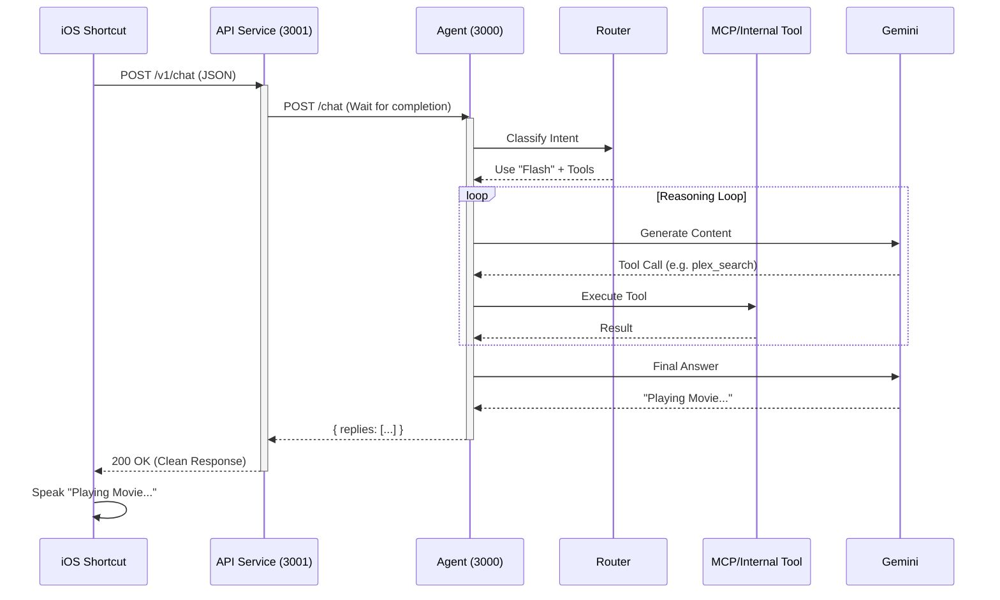
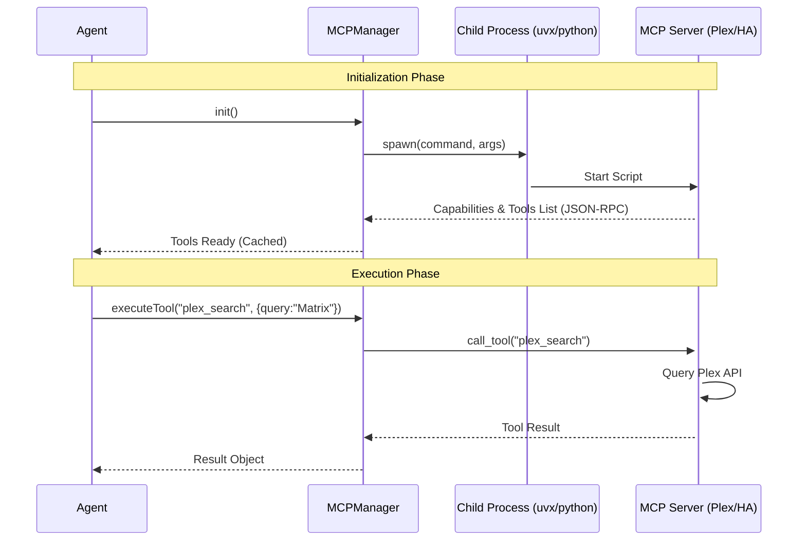

# Technical Sequence Diagrams

These diagrams illustrate the internal data flow of Deedee.

## 1. Synchronous API Flow (iOS Shortcuts)
Unlike the asynchronous Telegram bot, the API Service keeps the HTTP connection open until the Agent has fully processed the request (including all tool calls). This allows Siri/iOS to speak the final answer immediately.

## 2. MCP Tool Execution (Stdio Transport)
This diagram shows how the Agent orchestrates external processes (like Python scripts) using the Model Context Protocol.

